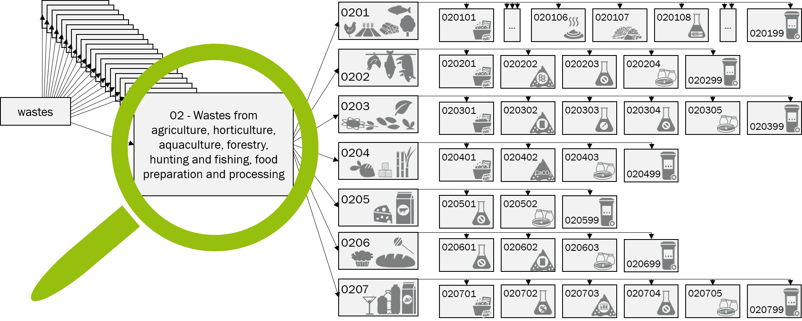

# European Waste Catalogue Ontology

## Intoduction

The ewc-onto is the translation of the [European Waste Catalogue](http://data.europa.eu/eli/dec/2014/955/oj) (EWC) into an ontology. The hierarchy from the EWC was completely preserved, which means the ontology includes the 20 top-level categories (waste classes), subordinated the waste groups per waste class, and as lowes level the residues per waste group. This structure results in 990 classes in the ontology. These classes are named by their waste code from the EWC, which is two numbers per layer, and by their human understandable description. Additionally, the waste code can be given as a data property. The structure of the EWC is depicted in Fig. 1.

*Fig. 1. A view on the waste class 02 (wastes from agriculture, ...) and its subclasses as an example for the structure of the ontology. As names of the classes only their waste codes are given. Icon indicate the meaning of the class, whereby the same icons have the same meaning.*

The information about the hazardousness, which is also included in the EWC, is implemented as an additional class in the ontology with two subclasses (*hazardous* and *non-hazardous*). The third layer of the waste tree (residues) is connected to the second layer of the hazardousness tree via an object property (see gray dotted lines in Fig. 2).

*Fig. 2. Some exemplary classes (gray boxes with yellow circles) and instances (gray boxes with purple diamond) of ewc-onto and their connections (blue line - has subclass; purple line - has instance; gray dotted line - has some hazardousness of; green dashed - has hazardousness; yellow dashed line - is hazardousness of; orange dashed line - has hazardousness).
These tripples (class - connection - class) can be transformed into sentences (object - verb - object) as* Hazardousness has subclass Non-Hazardous *to capture their meening. This figure was made with OntoGraf in [Protégé](https://protege.stanford.edu/).*

In the current version (v1.0) English and German language are available. Additionally, four examplary instrances are included in the ontology. In the next version we plan to include more biogenic residues as instances. 

## Versions

[comment]: <> (- v2.0 - EWC implementation + residues from RedDB, last modified: work in progress) 
- v1.0 - EWC implementation + exemplary instances, last modified: May 2025 

## How to use

The ontology was developed with [Protégé](https://protege.stanford.edu/) and can be openend and transformed into other data types (owl, rdf) there without any problems.

New instances can be included in ewc-onto and by using the reasoner the waste instances can be assigned to the correct residue class.

## References
- [European Wase Catalogue](http://data.europa.eu/eli/dec/2014/955/oj) (2014/955/EU: Commission Decision of 18 December 2014 amending Decision 2000/532/EC on the list of waste pursuant to Directive 2008/98/EC of the European Parliament and of the Council Text with EEA relevance) from December 30 2014
- [Abfallverzeichnis-Verordnung](https://www.gesetze-im-internet.de/avv/AVV.pdf) (Verordnung über das Europäische Abfallverzeichnis (Abfallverzeichnis-Verordnung - AVV)) from 30 June 2020
- [Protégé](https://protege.stanford.edu/)

## See also
- [An ontology to identify biogenic wastes and residues from bioeconomy](https://doi.org/10.37307/j.1863-9763.2025.06.03), published June 11 2025, publication language German
